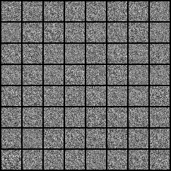
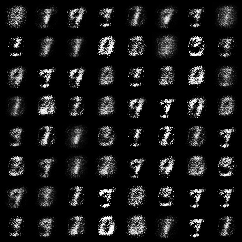

# SimpleGANs_Model
<h2>Simple GANs model using MNIST datasets </h2> 
this model just generate data doesnot exist in real world  
the data we have trained digits number 
the model is free from CNNs and it make result  
<h3>before training model and it 's  generated images like</h3>  

<h3>after training model and it 's  generated images like</h3>  

